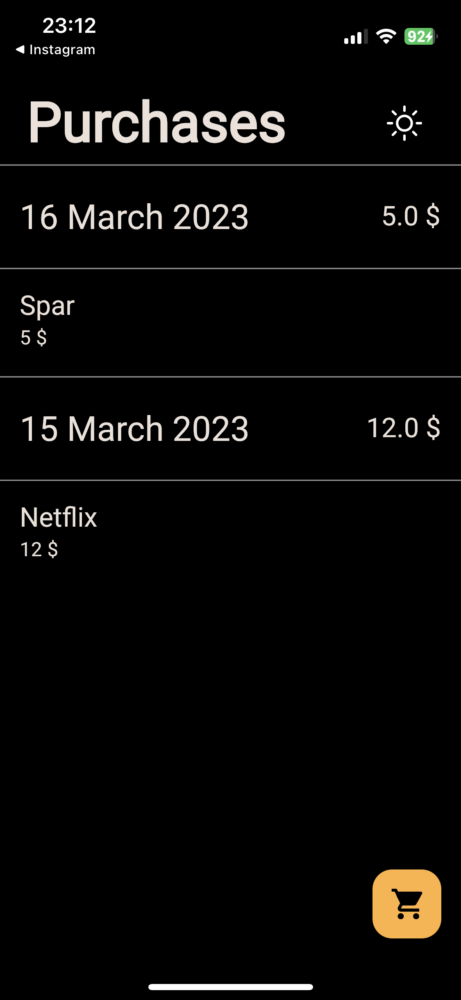
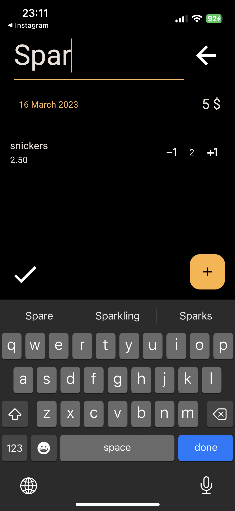
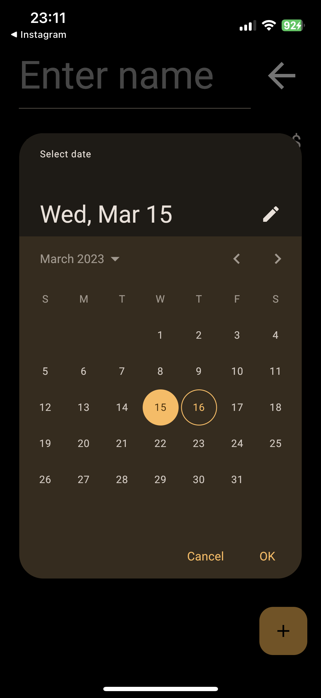
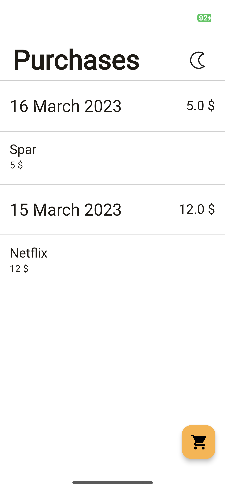

# Menu

- [Shopping Calculator App](#shopping-calculator-app)
    - [Problem](#problem)
    - [Solution](#solution)
- [Screenshots](#screenshots)
- [Technologies](#technologies)
- [Getting Started](#getting-started)
- [Future Road Map](#future-road-map)
- [License](#license)
- [Contact](#contact)

# SimpliBuy - Shopping Calculator App
This is a Flutter app that helps users keep track of the total cost of their shopping while they add items to their basket.

## Problem
Very often people fill up a basket and then at the cash register they find out the price of their purchases, which is good for the stores, because usually even if a person is unpleasantly surprised at the cash register at the cost of the total purchase he will still pay. My idea is to make the app no more complicated than a calculator, but a little more convenient. In the calculator, if you refuse an item, you have to subtract the amount you have previously entered, which is a bit inconvenient.

## Solution
This app provides a convenient way for users to keep track of the total cost of their shopping as they add items to their basket. Users can add and remove items, and the app automatically calculates and displays the total cost. This helps users to stay within their budget and avoid any surprises at the cash register.

# Screenshots

|  |   |   |
| -------- | -------- | -------- |
| |  |  |
| All Purchases | Add Item | Dialog |
|  |  |  |
| Date Selection | Delete Purchase Dialog | Light version |

# Technologies

- freezed_annotation: A code generation library that helps to write immutable classes with ease.
- json_annotation: A library for converting Dart objects to and from JSON.
- get_it: A simple Service Locator for Dart and Flutter projects.
- flutter_svg: A Flutter library for rendering SVG images.
- google_fonts: A Flutter library for using custom fonts from the Google Fonts catalog.
- flutter_bloc: A state management library for Flutter that helps to separate presentation and business logic.
- shared_preferences: A Flutter library for storing key-value pairs on disk.
- grouped_list: A Flutter library for displaying lists with section headers.
- intl: A library for internationalization and localization in Dart.
- sqlite3_flutter_libs: A Flutter library for using the SQLite database engine.
- path_provider: A Flutter library for accessing the filesystem.
- cupertino_icons: An icon pack for Flutter that provides iOS-style icons.
- go_router: A library for creating declarative routing flows in Flutter.

# Getting Started
Before running the app, it's important to generate the necessary freezed classes for state management. To generate the necessary classes, run the following command in the terminal:

```flutter pub run build_runner build --delete-conflicting-outputs```

This will generate the necessary files and allow you to use freezed classes in your app for state management.

Once the necessary classes have been generated, you can run the app using the following command:

```flutter run```

# Future Road Map
As SimpliBuy continues to evolve, there are several features and improvements that I plan to add to the app in the coming months. Some of the items on my roadmap include:

- Improved reporting and analytics: I plan to add more robust reporting and analytics capabilities to SimpliBuy, allowing users to gain insights into their shopping habits and identify areas where they can save money.

- Additional languages: I aim to make SimpliBuy accessible to users around the world, and plan to add support for additional languages in the future.

- Bug fixes and performance improvements: As with any software project, I will continue to identify and address any bugs or performance issues that arise, to ensure that SimpliBuy is always running smoothly.

We are committed to making SimpliBuy the best shopping app on the market, and will continue to add new features and improvements to the app over time.

# License
This project is released under the [MIT License](https://opensource.org/licenses/MIT).

# Contact 
- [Telegram](https://t.me/flutter_app_creator)
- [Email](mailto:huzhah@gmail.com)
